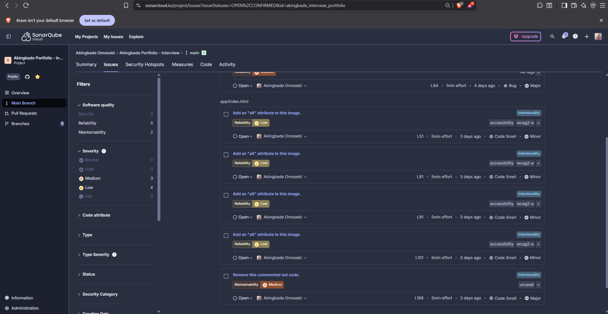
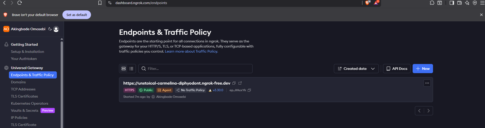
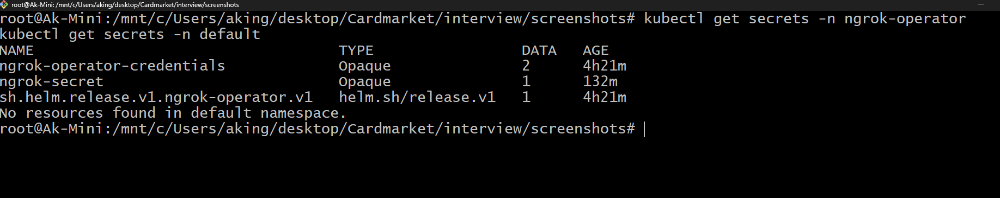
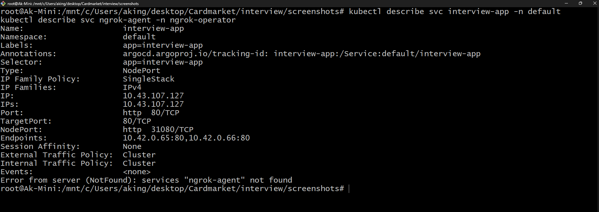
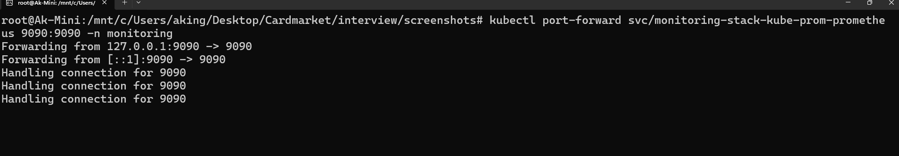

# Project "Opsfolio" - The Evolved Interview App.

  - Opsfolio: From Interview Task → DevSecOps Mastery.
  - This repository demonstrates how a simple interview app became a production-ready, security-hardened DevOps portfolio project.

# Intro Section

  - Originally built as part of a DevOps technical assessment, this project has been refined and extended into my personal DevSecOps portfolio showcase.

   * The application, originally named Interview App, now serves as a practical demonstration of my growth and skillset.

  - In short: it started as an interview task, now it’s my Opsfolio: a hands-on reflection of how I can build, secure, and deploy software.

# Project Overview

This project demonstrates a fully automated CI/CD pipeline for a custom web application using modern DevOps and GitOps practices. The pipeline includes linting, code quality checks, containerized builds, vulnerability scanning, and automated deployment with semantic versioning and redundancy checks. 

The environment uses a local K3s Kubernetes cluster orchestrated with ArgoCD and ArgoCD Image Updater.


   * Main Objectives:

    - Build and maintain a secure, containerized web application (HTML/CSS/JS).

    - Implement robust CI/CD pipelines with GitHub Actions and GitOps with ArgoCD.

    - Ensure automated and reproducible deployment using GitOps principles.

    - Keep the container registry clean with semantic versioning and change detection.

    - Enable external access and endpoint protections to the cluster for testing and security hardening.


 ### TL;DR. FINAL APPLICATION RUNNING LINK + ASCII DIAGRAM:

   - https://unstoical-carmelina-diphyodont.ngrok-free.dev/   


   ### Live Demo Information

        ⚠️ Note:
                This application is exposed using Ngrok, which creates a secure tunnel from my local K3s cluster to the public internet.
                As this environment runs locally, the demo URL may be offline when my workstation is not active (e.g., in sleep mode to save power, and laptop battery efficiency).

                However, all configuration manifests, screenshots, and monitoring dashboards (Grafana, Prometheus, ArgoCD, Ngrok) have been fully documented and can be easily reproduced using the provided Kubernetes manifests and Helm configurations.


```
+-----------------+        Git Push       +---------------------------+
|                 |  ----------------->  |                           |
|  Developer      |                      |  GitHub Repository        |
|  (Local Code)   |                      |  (Application + K8s YAML)|
|                 |                      |                           |
+-----------------+                      +---------------------------+
                                                  |
                                                  | GitHub Actions CI/CD
                                                  v
                                          +---------------------+
                                          |                     |
                                          |  CI/CD Workflows    |
                                          |  - GitLeaks (Scan)  |
                                          |  - Megalinter       |
                                          |  - Trivy Scan       |
                                          |  - SonarCloud Scan  |
                                          |  - Build & Push     |
                                          |    Docker Image     |
                                          |                     |
                                          +---------------------+
                                                  |
                                                  v
                                          +---------------------+
                                          |                     |
                                          |  ArgoCD GitOps      |
                                          |  - Watches Repo     |
                                          |  - Deploys K3s      |
                                          |  - Updates Images   |
                                          |    via Image Updater|
                                          |  - Enforces Security|
                                          |    Policies & Sync  |
                                          +---------------------+
                                                  |
                                                  v
           +----------------+           +---------------------+
           |                |           |                     |
           |  K3s Cluster   |<--------->|  SealedSecrets      |
           |  (Local / EC2) |           |  & Secrets Mgmt     |
           | - Namespaces   |           | - Grafana Admin     |
           | - Deployments  |           | - Alertmanager SMTP |
           | - Services     |           | - DB & API Keys     |
           +----------------+           +---------------------+
                    |
          ---------------------------
          |           |             |
          v           v             v
+----------------+  +---------------------+  +---------------------+
|                |  |                     |  |                     |
|  Prometheus    |  |  Grafana Dashboard  |  |  Alertmanager       |
|  - Metrics     |  |  - Visualizes       |  |  - Configures       |
|    Collection  |  |    Prometheus Data  |  |    Alerts           |
|  - Node/Pod    |  |  - Kubernetes Dash  |  |  - Sends Notifications|
|    Metrics     |  |  - App Dashboards   |  |    via Email / Webhook|
+----------------+  +---------------------+  +---------------------+
                    |
                    v
           +---------------------+
           |                     |
           |  Ngrok Agent        |
           | - Exposes Local App |
           |   to Public URL     |
           | - Traffic Logging   |
           | - Optional CIDR     |
           |   restrictions      |
           | - Debugging & Inspect|
           +---------------------+
                    |
                    v
           +---------------------+
           |                     |
           |  Public Access      |
           |  - Interview App    |
           |  - QA / Client Test |
           |  - Secure Tunneling |
           +---------------------+


```


0. Application Setup

   - Technology: Custom HTML, CSS, JS application.

   - Development Environment: VSCode on Windows 11 with WSL + Ubuntu.

   - Containerization: Docker, for consistent environment across local and CI/CD.

   * Steps:

     - Initialize the application in VSCode.

     - Structure the app in a directory called app/.

     - Ensure the application can run locally via index.html and supporting assets.

   * Tools:

        Visual Studio Code — IDE for development.

        Docker — containerization platform.

Why:

 - Docker ensures that the app runs identically across all environments, avoiding “it works on my machine” issues.


1. GITLEAKS (CI) Pipeline

* 1.1. GitLeaks:

    - Purpose: To scan and capture confidential or sensitive data before it reaches the repo.

    - Config: showcased to capture stuffs like API keys if included, passwords, tokens, authkeys, etc.

    - Outcome: Prevents the publishing of sensitive data to prevent compromise of information.


2. Continuous Integration (CI) Pipeline

* 2.1. Megalinter

   -  Purpose: Catch linting errors in HTML, CSS, and JS before code progresses.

   -  Configuration: Integrated as a GitHub Action.

   -  Outcome: Enforces coding standards, preventing syntax and style issues.


* 2.2. SonarCloud

   - Purpose: Analyze code quality, test coverage, and maintainability metrics.

   - Integration: GitHub Action triggered after Megalinter.

   - Outcome: Provides a dashboard to visualize code health.


Why:

 - SonarCloud adds a quality gate before Docker build, ensuring only healthy code is packaged.


2.3. Docker Build and Trivy Scan

Purpose: Containerize the application and scan for vulnerabilities.

Semantic Versioning (SemVer): 1.0.<github.run_number> used for patch version increments.

Redundancy Check: Build occurs only if app code changed, using Git diff check.

* GitHub Actions Step Example:

    - name: Check if app code changed
   ``` 
   run: |
        git fetch --depth=2
        if git diff --quiet HEAD^ HEAD -- ./app; then
        echo "No changes in app, skipping Docker build and Trivy scan."
        exit 0
        fi
        ```


Trivy Scan:

 - Fail workflow if vulnerabilities detected to prevent insecure images from being pushed.

Why:

 - This ensures only secure and updated container images are deployed, minimizing risk.


2.4. Docker Push to GitHub Container Registry (GHCR)

 - Purpose: Store container images in a secure registry.

 - SemVer and SHA Tags: latest, SHA, and 1.0.x tags for version traceability.

 - Redundancy Check: Push only if there are actual changes in app code.


  * Workflow Details:

    - Login to GHCR using a personal access token (GHCR_PAT).

    - Rebuild image in the push workflow since CI runners are ephemeral.

    - Push only if app code changed, reducing unnecessary storage usage.


3. Infrastructure Setup


 - OS & Environment: Windows 11, WSL, Ubuntu.

 - Kubernetes Cluster: K3s managed locally with Rancher for orchestration.

 - Deployment Replicas: 2 replicas for high availability.

 - Service: Exposes container via NodePort.

 - Access: ngrok was used for external testing and network hardening.


* Why K3s:

 - Lightweight, fast, and compatible with ArgoCD for GitOps deployment.

 - Easy to deploy locally on Windows with WSL.


4. Continuous Deployment (CD) via GitOps

* 4.1. ArgoCD

  - Purpose: Automates syncing of Git repository with Kubernetes cluster.

  -  Configuration: Deployment manifest and service synced automatically.

  -  Sync Options: prune: true, selfHeal: true for automated management.


* 4.2. ArgoCD Image Updater

  - Purpose: Automatically updates deployment images in Git and/or cluster.

  - Update Strategy: semver:~1.0 — picks the latest patch version.

  - Write-Back Method: git — commits updated image tags back to repository.

  - Secret: GitHub PAT stored as Kubernetes secret in argocd namespace.

* Example Application Annotation:

       ``` 
       annotations:
            argocd-image-updater.argoproj.io/image-list: interview-app=ghcr.io/akingbadeomosebi/interview-app
            argocd-image-updater.argoproj.io/interview-app.update-strategy: semver:~1.0
            argocd-image-updater.argoproj.io/interview-app.force-update: "true"
            argocd-image-updater.argoproj.io/write-back-method: git
            argocd-image-updater.argoproj.io/git-https-username-secret: argocd-image-updater-git
            argocd-image-updater.argoproj.io/git-https-password-secret: argocd-image-updater-git
            ```


* Why git write-back:

  - Keeps Git repository as source of truth.

  - Deployment history is preserved.

  - Enables reproducible rollbacks.


* 4.3. Deployment.yaml & Kustomize

      - Deployment replicas: 2 for HA.

      -  RollingUpdate strategy: maxUnavailable=0, maxSurge=1.

      - Resource limits: CPU and memory configured to prevent cluster overload.

      - Image tag placeholder: :latest or :1.0.x updated automatically by Image Updater.

    * Kustomize:

      - Manages overlays and customization for cluster manifests.

      - Enables ArgoCD to apply consistent deployment updates.


* 4.4. External Access & Hardening

     - ngrok WAF allows secure testing from outside your local network and other potential endpoint security, traffic policy, SSH public keys, IP Restrictions, Certificate authorizations, Traffic inspection,  implementations.

     - Use case: For QA testing and simulating public access.


5. Semantic Versioning and Redundancy Prevention

 * Semantic Versioning (SemVer): 1.0.<github.run_number> for patch updates.

 * Redundancy Prevention:

    - Docker images are only built/pushed when actual app code changes are detected.

    - Reduces registry storage usage.

Improves reproducibility and traceability.

6. Summary of CI/CD Flow

  - Developer pushes code → triggers Megalinter → SonarCloud → Docker Build & Trivy scan.

  - Docker images are tagged with SHA, latest, and SemVer.

  - If scan passes and code changed → Docker image pushed to GHCR.

  - ArgoCD Image Updater detects new SemVer image → commits updated image tag to Git.

  - ArgoCD syncs cluster → new deployment applied with rolling update strategy.

  - Application accessible externally via ngrok for testing/hardening.


7. Challenges Faced

* Redundant image builds:

  - Initially, every workflow run created new images even when code did not change.

  - Solved by Git diff check before Docker build.

* Ephemeral CI runners:

  - Docker images from build workflow did not persist to push workflow.

  - Solved by rebuilding image in push workflow.

* Git write-back authentication:

  - Needed GitHub PAT to commit image updates.

  - Ensured correct secret creation and permissions in argocd namespace.

* Semantic versioning integration:

  - Needed to automate patch increments without pushing unnecessary tags.

  - Solved using GitHub run number + code change detection.

* Local cluster access:

  - Exposing K3s cluster externally required ngrok and security considerations.


# Last minute implementation: Added NGROK in Agentic mode as a reverse proxy and WAF.


* Ngrok Integration for Interview App

    * Overview

        Ngrok is used to expose local services securely over the internet without directly exposing the cluster via a public IP. For  this project, we deployed Ngrok as an agent within the Kubernetes cluster, which forwards traffic to the interview-app service.

    * Key objectives of this integration:

      - Securely expose the application for external access.

      - Use IP restrictions to allow/deny traffic from specific ranges.

      - Enable request rate-limiting.

      - Ensure secrets (Ngrok authtoken) are not hard-coded using kubeseal.

      - Use ArgoCD for full GitOps deployment — no manual kubectl apply.


    * Architecture:

         -   [User] ---> [Ngrok Public URL] ---> [Ngrok Agent Pod] ---> [interview-app Service] ---> [Deployment]

    
        - The Ngrok Agent runs as a Deployment in the ngrok-operator namespace.

        - All sensitive data is stored in sealed secrets, which are encrypted and only decrypted inside the cluster.

        - ArgoCD monitors the Git repository for manifests and ensures the Ngrok agent is always deployed with the correct configuration.


    # Secrets Management

       * We used Bitnami SealedSecrets to handle sensitive data such as:

        - NGROK_AUTH_TOKEN (Ngrok authtoken)

        - Application username/password (if needed)


    * Steps:
        - 1  Create a raw secret manifest (ngrok-secret-raw.yaml) containing the authtoken:

          ```
          apiVersion: v1
             kind: Secret
             metadata:
                name: ngrok-secret
                namespace: ngrok-operator
             type: Opaque
             data:
                authtoken: <base64-encoded-token>
                ```

        - 2 Seal the secret using kubeseal with the cluster controller certificate:

           ``` 
           kubeseal --controller-namespace=kube-system \
                     --controller-name=sealed-secrets-controller \
                     -o yaml < ngrok-secret-raw.yaml > ngrok-secret.yaml
                     ```

        - 3 Commit the secret using kubeseal with the cluser controller certificate.

        - 4 ArgoCD applies the sealed secret and the controller decrypts it within the cluster.

            | This ensures sensitive information is never exposed in git or deployment files


    
## NGROK AGENT DEPLOYMENT


   * The Ngrok agent runs as a Kubernetes Deployment targeting the interview-app service. Configuration highlights:

     - Exposes HTTP traffic from Ngrok to the app service.

     -  IP restrictions using --allow-cidr and --deny-cidr.

     - Request rate-limiting with --rate-limit.

     -  Logging enabled to stdout for visibility.

     - Pulls the authtoken from the sealed secret.

    
# Accessing the Ngrok URL

    Once the Ngrok Agent Pod is running, the piblic URL is displayed in the pod logs:

    ```
    kubectl logs -l app=ngrok-agent -n ngrok-operator
    ```

  *  This URL can be shared for external access, while IP restrictions and rate-limiting ensure secure usage.


# Security and Policy Considerations

   - Secrets: All sensitive information is encrypted using SealedSecrets.

   - IP Restrictions: --allow-cidr and --deny-cidr limit access to approved networks.

   - Rate Limiting: --rate-limit protects against excessive requests.

   - Logging: All traffic and events are logged to stdout, enabling monitoring.

   - GitOps Compliance: No manual kubectl apply is used; ArgoCD manages all resources.


8. Monitoring and Alerting with Prometheus & Grafana

 * The project uses Prometheus for metrics collection and Grafana for visualization, providing real-time insight into the Kubernetes cluster and deployed applications.

    - Prometheus scrapes metrics from Kubernetes components, pods, and services, enabling monitoring of CPU, memory, network usage, and application health.

    - Grafana connects to Prometheus as a data source and displays metrics in interactive dashboards, including the default Kubernetes cluster dashboard.

    -  Alerts are configured via Alertmanager to notify on critical conditions, with email notifications demonstrated for Gmail.

    Example snippet used to enable Alerting via Email (GMAIL).

    ```
    alertmanager:
      alertmanagerSpec:
        config:
          global:
            smtp_smarthost: 'smtp.gmail.com:587'
            smtp_from: 'your-email@gmail.com'
            smtp_auth_username: # reference Kubernetes secret
              name: gmail-secret
              key: username
            smtp_auth_password: # reference Kubernetes secret
              name: gmail-secret
              key: password
        route:
            receiver: 'email-notifications'
        receivers:
            - name: 'email-notifications'
            email_configs:
                - to: 'your-email@gmail.com'
                send_resolved: true

    ```

    -  The setup is fully managed via ArgoCD, ensuring GitOps-driven deployment, automated updates, and secure secret handling using SealedSecrets.

    -  This monitoring stack ensures observability, proactive alerting, and maintains security best practices by avoiding hardcoded credentials.


# Notes 

 * Success and Failures
     - Added and removed extra features as they were test features such as --auth, --cidr, etc to expand on the project.
     - CloudEndpoint CRD was discarded in favor of the agent endpoint, which is simpler for local development and ArgoCD-based deployment.

9. References and Links

Tool	                    Purpose                                         	Documentation

VSCode	                    Development	                                        https://code.visualstudio.com/

Docker	                    Containerization	                                https://docs.docker.com/get-docker/

Megalinter	                Linting	                                            https://nvuillam.github.io/mega-linter/

SonarCloud	                Code quality (SAST)                                 https://sonarcloud.io/documentation/

GHCR	                    Container registry	                                https://docs.github.com/en/packages/wrking-with-a-github-packages-registry/working-with-the-container-registry

Trivy	                    Security scan	                                    https://github.com/aquasecurity/trivy-action

K3s	                        Kubernetes cluster	                                https://k3s.io/

Rancher	                    Cluster management	                                https://rancher.com/

ArgoCD	                    GitOps deployment	                                https://argo-cd.readthedocs.io/en/stable/

ArgoCD Image Updater    	Auto image update	                                https://argocd-image-updater.readthedocs.io/en/stable/

Kustomize	                Manifest customization                          	https://kubectl.docs.kubernetes.io/references/kustomize/

ngrok	                    External access (WAF, like CLoudFlare)              https://ngrok.com/docs


## Screenshots


### 1. Agents
Demonstrates the various agents running in the Kubernetes cluster, including the ngrok-agent and ngrok-operator-agent pods, interconnected and providing feedback on the dashboard through the Authtoken and Api.


### 2. App Live
Shows the live deployment of the interview-app running on Kubernetes, accessible through the NodePort service.


### 3. ArgoCD App
Displays the ArgoCD application view for the CardMarket assessment project.


### 4. ArgoCD
Shows the ArgoCD dashboard with all deployed applications.


### 5. GHA Megalinter
Displays GitHub Actions running the MegaLinter workflow for code quality checks.
.png)

### 6. SonarQube
Shows the SonarQube dashboard analyzing code quality and test coverage.


## 7. OVERVIEW SONARQUBE


### 8. GHA Push Image to GHCR
Shows the workflow that builds and pushes Docker images to GitHub Container Registry (GHCR).
.png)

### 9. GHA SonarQube Scan
Displays the workflow that scans the code with SonarQube/SonarCloud.
.png)

### 10. GHA Build and Scan with Trivy
Shows the workflow that performs Trivy vulnerability scans on Docker images.


### 11. GHA All Workflows
Shows a summary of all GitHub Actions workflows for the project.


### 12. K3S Distro
Shows the K3S lightweight Kubernetes cluster used for testing and deployment.


### 13. Ngrok Local UI Inspect
Shows the ngrok agent local UI inspecting the live tunnel and traffic.
.png)

### 14. Ngrok Local UI Port Forward to Local Host
Demonstrates how the ngrok tunnel forwards traffic from the public URL to the local Kubernetes service.
.png)

### 15. Ngrok Local UI Status Report
Shows the current status of the ngrok tunnel and connected endpoints.
.png)

### 16. Ngrok Endpoint
Displays the ngrok public endpoint that exposes the local app to the internet.


### 17. Ngrok Terminal
Shows the terminal output of the ngrok agent container inside Kubernetes.


### 18. Ngrok Traffic Inspector
Displays traffic details for requests passing through the ngrok tunnel.


### 19. WSL Win11
Displays the Windows Subsystem for Linux (WSL) setup on Windows 11 used for the local development environment.


### K3S CLUSTER 

### 20. All pods Across All Namespaces
This screenshot shows all pods running in my cluster across all namespaces. You can see both the interview-app pods in the default namespace and the ngrok-agent and ngrok-operator pods in the ngrok-operator namespace. It confirms that all components of the project are deployed successfully


### 21. All Services Across All Namespaces
Here I display all Kubernetes services. The interview-app NodePort service is visible, along with internal services for ngrok-agent and ngrok-operator. This ensures traffic routing is correctly configured in the cluster.


### 22 Deployments in Namespaces
This screenshot shows the deployments in the namespaces. You can verify the number of replicas, container images, and current pod status. It shows that ngrok-agent and interview-app deployments are running as expected.


### 23. Pod Details.
Here we inspect the details of a specific pod. This includes the pod’s labels, node assignment, container configuration, and recent events. It’s useful to verify environment variables, volumes, and network connectivity for debugging purposes.


### 24. Pod Logs
This screenshot shows logs from the ngrok-agent pod. It confirms the ngrok tunnel is established and provides the live public URL for external access to the application. Logs also help in troubleshooting connection issues.


### 25. Sealed Secrets
SealedSecrets are used to store sensitive data in the cluster safely. This screenshot shows the ngrok-secret and interview-app-auth SealedSecrets applied in the ngrok-operator namespace.


### 26. K8s Secrets
This screenshot shows decrypted Kubernetes secrets available in the cluster. They are derived from the SealedSecrets and used by pods to authenticate with ngrok or other services.



### 27. K8s Services with Ports
Here we describe the services along with their port mappings, ClusterIP, and selectors. This verifies that the interview-app NodePort and internal ngrok services are correctly routing traffic.



## PROMETHEUS AND GRAFANA


### 28. GRAFANA DASHBOARD
Shows the dashboard of Grafana for Observability and Telemetry


### 29. GRAFANA SVC
Shows the serevices associated with Grafana


### 30. GRAFANA LIVE VISUAL
Shows the live visual representation of a service health in Grafana


### 31. MONITORING PODS
Pods associated with the monitoring namespace for Grafana & Prometheus


### 32. PROMETHEUS PORT
Port use to access prometheus server running


### 33. PROMETHEUS SERVER RUNNING
Live Prometheus Server Running and Accessed


### Final Application LIVE & Running URL LINK:

https://unstoical-carmelina-diphyodont.ngrok-free.dev/


### Live Demo Information

        ⚠️ Note:
                This application is exposed using Ngrok, which creates a secure tunnel from my local K3s cluster to the public internet.
                As this environment runs locally, the demo URL may be offline when my workstation is not active (e.g., in sleep mode).

                However, all configuration manifests, screenshots, and monitoring dashboards (Grafana, Prometheus, ArgoCD, Ngrok) have been fully documented and can be easily reproduced using the provided Kubernetes manifests and Helm configurations.